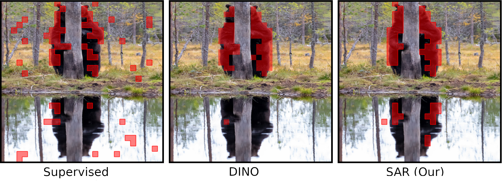

# **Spatial Entropy as an Inductive Bias for Vision Transformers**

> **Spatial Entropy as an Inductive Bias for Vision Transformers**
> 
> [Elia Peruzzo](https://helia95.github.io/), [Enver Sangineto](https://aimagelab.ing.unimore.it/imagelab/person.asp?idpersona=144), [Yahui Liu](https://yhlleo.github.io/), [Marco De Nadai](https://www.marcodena.it/), [Wei Bi](https://scholar.google.com/citations?user=aSJcgQMAAAAJ&hl=en), [Bruno
Lepri](https://ict.fbk.eu/people/detail/bruno-lepri/), [Nicu Sebe](https://disi.unitn.it/~sebe/)

> **Abstract**: Recent work on Vision Transformers (VTs) 
showed that introducing a local inductive bias in the VT helps in reducing the number of  samples necessary for training.
In this work, we propose a different and complementary direction, in which a local bias is introduced using {\em an auxiliary self-supervised task}, used jointly with standard supervised training.
Specifically, we exploit the observation that
the attention maps of VTs, when trained with self-supervision,  can contain a semantic segmentation structure which does not spontaneously emerge when training is supervised. 
In this paper, we encourage the emergence of this spatial clustering as a form of training regularization.
In more detail, we exploit the assumption that, in a given image, objects usually correspond to  few connected regions, and we
propose a spatial formulation of the information entropy to quantify this {\em object-based inductive bias}.
 By minimizing the proposed spatial entropy, we include an additional self-supervised signal
 during training. Using extensive experiments, we show that the proposed regularization  is beneficial with different training scenarios,  datasets, downstream tasks and VT architectures, and it can dramatically boost the VT final accuracy when using small-medium training sets.

> Preprint: [ArXiv](https://arxiv.org/abs/2206.04636).

### Training
Training can be performed with the following command (e.g. on ImageNet-1k)

```
python -u -m torch.distributed.launch --nproc_per_node=8 --use_env main.py \ 
    --batch-size 128 \
    --epochs 300 \
    --data-set imagenet \
    --data-path <path_to_imagenet> \
    --no-repeated-aug \
    --use-blob \
    --use-nosn \
    --blob-weight 0.01 
```

To train on other dataset, change the `--dataset` and `--data-path` arguments.

### Evaluation
To evaluate a pretrained model, run:

```python main.py --eval --resume <path_of_pretrained_model> --data-path <path_to_imagenet>```

Set ```--use-nosn``` to remove last skip connection and layer normalization.


### Fine-tuning
To fine-tune a pretrained model, run:

```
python -u -m torch.distributed.launch --nproc_per_node=8 --use_env main.py \
    --batch-size 64 \
    --epochs 100 \
    --lr 5e-4 \
    --no-pin-mem  \
    --warmup-epochs 3 \
    --data-set cifar10 \
    --no-repeated-aug \
    --resume <path_of_pretrained_model>
```

Set ```--use-blob --blob-weight 0.01``` to use spatial entropy loss during fine-tuning along with cross-entropy loss.
Set ```--use-nosn``` to remove last skip connection and layer normalization.


### Segmentation on PASCAL-VOC
To evaluate the segmentation properties of the attention maps of a pretrained ViT on PASCAL-VOC 2012, run:

```python evaluate_segmentation.py --pretraining supervised --pretrained_weights <path_of_pretrained_model> --voc_path <path_pascal-voc_dataset>```


### Attention Maps Visualization
To visualize the attention map of the last transformer block of a pretrained ViT, run:

```python visualization.py --pretraining supervised --pretrained_weights <path_of_pretrained_model> --test-dir <path_of_test_images>```

### ImageNet-A and ImageNet-C
We refer the reader to the correspondent source code for evaluation on [ImageNet-A](https://github.com/hendrycks/natural-adv-examples) and [ImageNet-C](https://github.com/hendrycks/robustness).


## Citation

```
@misc{https://doi.org/10.48550/arxiv.2206.04636,
  url = {https://arxiv.org/abs/2206.04636},
  author = {Peruzzo, Elia and Sangineto, Enver and Liu, Yahui and De Nadai, Marco and Bi, Wei and Lepri, Bruno and Sebe, Nicu},
  title = {Spatial Entropy as an Inductive Bias for Vision Transformers},
  publisher = {arXiv},
  year = {2022},
}
```

## Acknowledgement
Our code borrows from [DEiT](https://github.com/facebookresearch/deit), [DINO](https://github.com/facebookresearch/dino),[Swin](https://github.com/microsoft/Swin-Transformer). We thank the authors for making their code publicly available.

